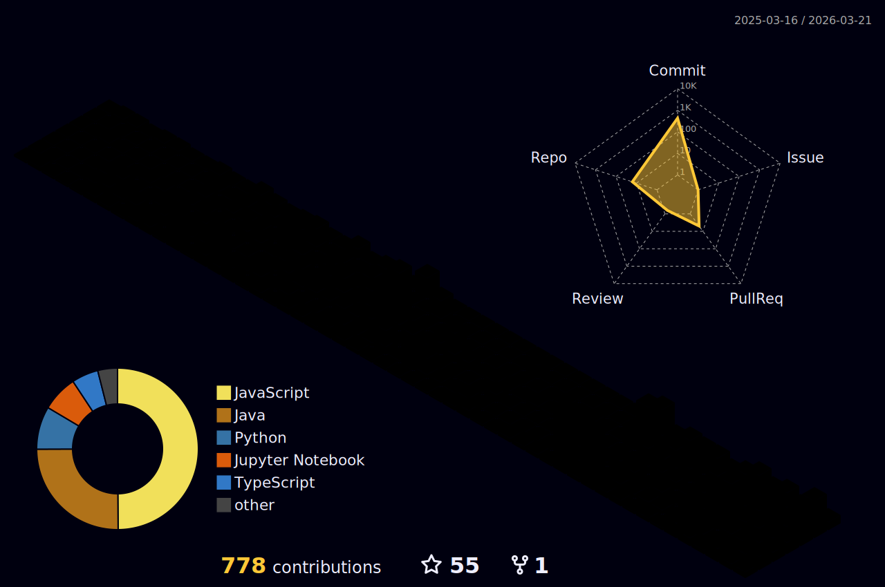

<div align="center">

<!-- ANIMATED HEADER WITH NAME -->


<br/>
<!-- 3D ANIMATED OCTOCAT / ELEMENT -->

<br/>

<a href="https://iamsarang.dev/">
  <!-- Using a custom coder font (Fira Code) for typing intro -->
  
</a>

<hr>

<p align="center">
  <a href="https://linkedin.com/in/sarang-gade"></a>
  <a href="https://iamsarang.dev/"></a>
  <a href="https://github.com/kodeMapper?tab=followers"></a>
  <a href="https://github.com/kodeMapper"></a>
</p>

**Building web platforms, automation workflows, and ML-backed tools that solve real problems.**
From a self-updating portfolio system to AI proctoring and maternal health ML, I build projects that combine product thinking with technical depth.

</div>

<br/>

### 👨‍💻 About Me

```javascript
const sarang = {
  currentlyBuilding: [
    "automation-first portfolio systems",
    "AI-assisted developer tools",
    "full-stack products with clean UX"
  ],
  learningMode: ["data structures", "system design", "ML deployment"],
  mindset: "Build it well, document it clearly, improve it continuously"
};
```

---

### 🚀 Tech Stack

<div align="center">

<p align="center">
  <a href="#"></a>
  <a href="#"></a>
  <a href="#"></a>
  <a href="#"></a>
</p>

<p align="center">
  <a href="#"></a>
  <a href="#"></a>
  <a href="#"></a>
  <a href="#"></a>
  <a href="#"></a>
  <a href="#"></a>
</p>

<p align="center">
  <a href="#"></a>
  <a href="#"></a>
  <a href="#"></a>
  <a href="#"></a>
  <a href="#"></a>
</p>

</div>

---

### 🏆 Featured Projects

<div align="center">
  <a href="https://github.com/kodeMapper/saranggade">
    
  </a>
  <a href="https://github.com/kodeMapper/interviewer-bot">
    
  </a>
  <a href="https://github.com/kodeMapper/pulseai-iot-ml-project">
    
  </a>
</div>

---

### 📊 GitHub Stats & Activity

<div align="center">
  <!-- GitHub Stats & Top Languages -->
  <a href="https://github.com/anuraghazra/github-readme-stats">
    
  </a>
  <a href="https://github.com/anuraghazra/github-readme-stats">
    
  </a>
</div>

<br/>

<div align="center">
  <!-- Streak Stats -->
  <a href="https://github.com/DenverCoder1/github-readme-streak-stats">
    
  </a>
</div>

<br/>

<div align="center">
  <!-- GitHub Activity Graph -->
  <a href="https://github.com/ashutosh00710/github-readme-activity-graph">
    
  </a>
</div>

<br/>

<div align="center">
  
</div>

<br/>

<div align="center">
  <!-- Glitch-free static image linking to the GitHub Action generated snake -->
  
</div>

---

<p align="center">
  <b>Built for fast scanning, strong signal, and real project depth.</b><br/>
  Always open for <b>Full-Stack Roles</b>, <b>Internships</b>, and <b>Collaborations</b>.

  <a href="https://linkedin.com/in/sarang-gade">
    
  </a>
</p>

<br/>

<div align="center">
  <!-- PRECISELY PLACED ANIMATED WAVING FOOTER -->
  
</div>
