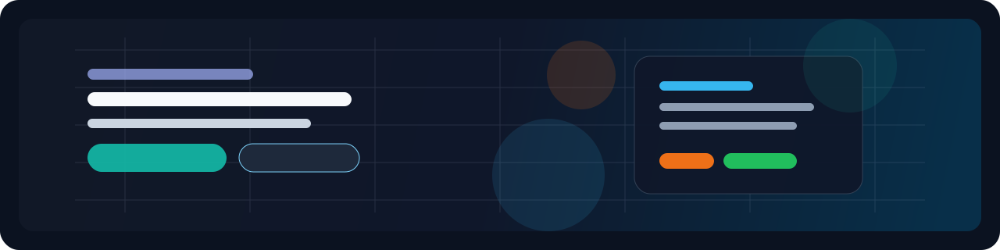

<div align="center">



# Sarang Gade


**Building web platforms, automation workflows, and ML-backed tools that solve real problems.**

From a self-updating portfolio system to AI proctoring and maternal health ML,
I like projects that combine product thinking with technical depth.

[](https://github.com/kodeMapper)
[](https://github.com/kodeMapper?tab=repositories)
[](https://iamsarang.dev/)
[](https://linkedin.com/in/sarang-gade)
[](https://github.com/kodeMapper)

</div>

## About

I am a **Computer Science and Electronics student** focused on building software
that feels useful, thoughtful, and production-minded.

My work spans **JavaScript, TypeScript, Python, Java, React, Next.js, Node.js,
FastAPI, Flask, MongoDB, and machine learning**, with a strong bias toward
projects that do more than just look good in a demo.

I enjoy working on systems where automation, clean interfaces, and measurable
outcomes matter.

```ts
const sarang = {
  currentlyBuilding: [
    "automation-first portfolio systems",
    "AI-assisted developer tools",
    "full-stack products with clean UX"
  ],
  learningMode: ["data structures", "system design", "ML deployment"],
  mindset: "Build it well, document it clearly, improve it continuously"
};
```

## Top Skills

**Languages**
`JavaScript` `TypeScript` `Python` `Java`

**Frontend**
`React` `Next.js` `HTML` `CSS`

**Backend**
`Node.js` `Express.js` `FastAPI` `Flask`

**Data / ML**
`scikit-learn` `SMOTE` `OpenCV` `MongoDB`

**Tools**
`Git` `Docker` `GitHub Actions` `Vercel` `Render`

<details>
  <summary><b>Expanded Stack</b></summary>
  <br/>


</details>

## Featured Projects

### Sarang Gade: The Automated Smart Portfolio

**Outcome:** turned a personal portfolio into a self-maintaining system with
automation, review workflows, and deployment hooks.

- **Tech:** `Next.js` `Express.js` `MongoDB`
- **Build detail:** added GitHub sync, Codolio screenshot automation,
  Discord notifications, manual fallbacks for LinkedIn data, and
  human-in-the-loop approval before production updates.
- **Links:** [Repo](https://github.com/kodeMapper/saranggade) · [Live](https://iamsarang.dev/)

Why it matters: this is more than a portfolio site; it is a productized workflow
that reduces maintenance overhead and keeps personal branding continuously fresh.

### SecureProctor AI

**Outcome:** built an AI-based interview and exam proctoring system with live
monitoring, alerting, and webcam-based behavior checks.

- **Tech:** `Python` `FastAPI` `JavaScript`
- **Build detail:** implemented camera selection, MJPEG streaming,
  CNN-based gaze checks, face-count detection, MediaPipe fallback logic,
  and a browser dashboard for live status and violations.
- **Links:** [Repo](https://github.com/kodeMapper/interviewer-bot)

Why it matters: it tackles a hard real-world problem where accuracy, fallback
behavior, and usability matter more than surface polish.

### PulseAI: Maternal Health Risk Prediction System

**Outcome:** built a full-stack ML application that predicts maternal health risk
with **86.7% accuracy** and **94.5% recall** for high-risk cases.

- **Tech:** `Python` `React` `Flask`
- **Build detail:** compared 7 models, used SMOTE for class balancing,
  selected Gradient Boosting to reduce false negatives from 5 to 3,
  and wrapped the model in a React plus MongoDB workflow.
- **Links:** [Repo](https://github.com/kodeMapper/pulseai-iot-ml-project) · [Live](https://pulseai-frontend.vercel.app/)

Why it matters: it shows end-to-end thinking across ML, API design, frontend UX,
and domain-specific evaluation where recall mattered more than raw accuracy.

<div align="center">

<a href="https://github.com/kodeMapper/saranggade">
  
</a>
<a href="https://github.com/kodeMapper/interviewer-bot">
  
</a>
<a href="https://github.com/kodeMapper/pulseai-iot-ml-project">
  
</a>

</div>

## Achievements & Highlights

- Logged **674 contributions in the last year** on GitHub.
- Built across **27 public repositories** covering frontend, backend, Java,
  automation, and machine learning.
- Earned GitHub profile achievements including **Pair Extraordinaire**,
  **Pull Shark**, **Quickdraw**, and **YOLO**.
- Built a deployed portfolio system at [iamsarang.dev](https://iamsarang.dev/)
  with automated update workflows.
- Shipped projects spanning **AI proctoring**, **healthcare ML**,
  **portfolio automation**, and **DSA practice in Java**.

## GitHub Stats & Languages

<div align="center">


</div>

<div align="center">


</div>

## How I Work / Open To

- I prefer **clear specs, fast iterations, and practical solutions** over noise.
- Open to **internships**, **student developer roles**, and **meaningful collaborations**.
- Most interested in **full-stack product engineering**, **automation systems**,
  and **applied machine learning**.

## Contact / CTA

If you're building something ambitious or looking for a developer who likes hard
problems and fast learning curves, connect with me on
[LinkedIn](https://linkedin.com/in/sarang-gade) or explore my work at
[iamsarang.dev](https://iamsarang.dev/).

---

<div align="center">


<sub>
Built for fast scanning, strong signal, and real project depth.
</sub>

</div>
